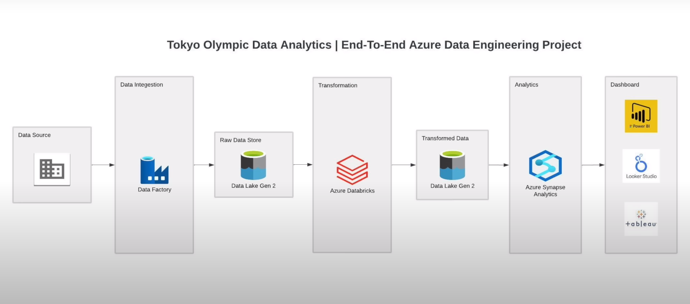

# 🏅 Tokyo 2020 Olympics - End-to-End Azure Data Engineering Project

This is a complete Azure-based data engineering and analytics project that demonstrates how to build a modern data pipeline for Tokyo Olympics 2020 dataset using Azure Data Factory, Data Lake, Databricks, Synapse, and Power BI.

---

## 📌 Project Objective

The main objective of this project is to **build an end-to-end data pipeline using Azure services** and generate insights by analyzing Tokyo Olympics 2020 data using **Power BI**.

The following Azure services were used:
- **Azure Data Factory** – Data integration and ingestion from GitHub
- **Azure Data Lake Gen2** – Storage for both raw and transformed data
- **Azure Databricks** – Data transformation using PySpark
- **Azure Synapse Analytics** – SQL-based data exploration and query execution
- **Power BI** – Interactive dashboard for final insights

✅ **Pipeline Summary**:
1. **Azure Data Factory** (a data integration service) reads the dataset from GitHub and writes it to **Azure Data Lake Gen2 (raw zone)**.
2. **Azure Databricks** reads the raw data, applies transformations using PySpark, and writes the cleaned data back to **Azure Data Lake Gen2 (transformed zone)**.
3. **Azure Synapse Analytics** (Lake Database) is used to define external tables on transformed data and run SQL queries to explore and analyze the data.
4. **Power BI** connects to Synapse, visualizes the results, and helps generate meaningful insights.

> 💡 **Note**: All of these steps could have been performed using just **Azure Synapse Analytics** (since it supports end-to-end workflows), but I intentionally used individual services to **deeply understand each component** and gain hands-on experience working with the full Azure Data Engineering stack.

---

## 🧱 Architecture

---

## 🛠️ Technologies Used

| Layer            | Services/Tools                              |
|------------------|---------------------------------------------|
| Ingestion        | Azure Data Factory                          |
| Storage          | Azure Data Lake Gen2                        |
| Transformation   | Azure Databricks (PySpark)                  |
| Analytics        | Azure Synapse Analytics (SQL queries)       |
| Visualization    | Power BI Desktop                            |
| Source Control   | GitHub                                      |

---

## 📂 Dataset Info

Dataset is originally from Kaggle but uploaded to my GitHub and ingested from there using Azure Data Factory.

Tables:
- `athletes.csv`
- `coaches.csv`
- `entriesgender.csv`
- `medals.csv`
- `teams.csv`

---

## 🔄 Pipeline Flow

### 1. **Ingestion Layer - Azure Data Factory**

Raw data is ingested from GitHub CSV files to Azure Data Lake Gen2.

✅ Sample ADF pipeline:

✅ Raw Data in ADLS:

---

### 2. **Transformation Layer - Azure Databricks**

Using PySpark in Databricks, transformations like cleaning, formatting, null handling, and schema corrections were applied.

📓 Notebook: `Databricks - Tokyo Olympic Transformation.ipynb`  
📁 Output stored in `transformed-data` container in ADLS:

---

### 3. **Analytics Layer – Synapse Analytics**

Created external tables in Synapse on the transformed data and queried them to perform data analysis.  
This helped extract key insights related to athlete participation, medal distribution, and gender-wise entries.

📊 **Dashboard Preview**

---

## 📈 Key Insights from the Dashboard

- 🥇 **USA** ranked #1 with the highest total medal count.
- 👥 **11,316 athletes** from **206 countries** participated.
- 🗺️ Global participation visualized on an interactive map.
- ⚧️ Gender ratio observed: **52% Male**, **48% Female**.

---

